```{r setup, include=FALSE}
options(htmltools.dir.version = FALSE)
```
class: middle, center

# Workshop RMarkdown & Friends
### Adnan Fiaz (@tapundemek)
### 26 Feb 2020

???
Contents Workshop (basics of rmarkdown 1st hour, friends 2nd hour)
Expectations: What will you learn? just the basics, no advanced ninja stuff
Basic knowledge necessary: little R-code, that's not what it will be about
Interactive: use laptop, RStudio Cloud or RStudio Server
Questions: ask anytime, just raise your hands or use Slack (add link here)
Ready?
---

# What is RMarkdown

* Yihui Xie & RStudio

* Code and Narrative

* Reproducibility

* Dynamic documents

???
Built on top of knitr package by Yihui and RStudio back in ....
Your analysis is rarely just a file with code in it.
Yes, that is part of it as that is how you execute the analysis.
But you also record your findings or conclusions. 
Often in a separate document and in the form of a narrative. RMarkdown fuses the two together. 
So on one side is the code to perform the analysis and on the other is the narrative which explains the results.
Having the two together leaves less room for error and increases the ability to reproduce the results.
In his 2018 keynote at EARL, Garret Grolemund (RStudio Chief Instructor) even aluded to RMarkdown 
being the solution to the reproducibility crisis in science.

So you have your code and narrative in one place but you still need to share the results. This is where RMarkdown really shines because it supports all sorts of output formats: HTML, PDF, Word, Beamer, scientific articles, books, dashboards, websites. And even shiny apps. 
---

# Create RMarkdown document

File --> New File --> R Markdown

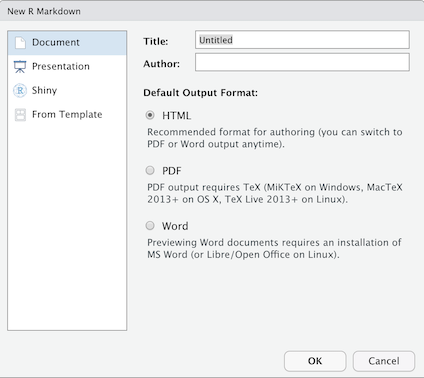

???
Talk about how other options are not important right now. 
You can choose other output formats but we'll stick to HTML as it's easiest to display.

---
# Rmd [Deconstructed]
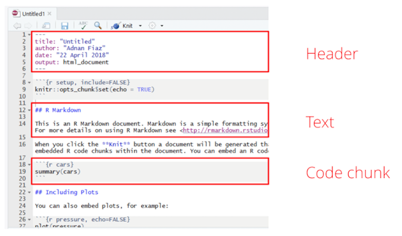
???
We can deconstruct a RMarkdown into three components
Header, Text and Code Chunks
We will discuss each of these in more detail starting with the Text part

---
# RMarkdown – code = Markdown

#### Markdown: Lightweight text formatting

* Headers (#, ##, ###)

* **Bold** (**), _Italic_ (_), ~~strikethrough~~ (~~)

* [Links]() [text here] (link here)

* Tables (it's complicated)

First Header  | Second Header
------------- | -------------
Content Cell  | Content Cell
Content Cell  | Content Cell

* Images ! [alt text] (image link)

.pull-right[

]
???
What we refer to as text in a Rmd doc is what is known as Markdown. 
Take away the code part and that is what you're left with.
Markdown offers very lightweight text formatting, something that is easy to use and easy to understand
You get your basic text formatting such as headers and making things bold or italic.
Added to that is the ability to create links (example here).
And Tables but these are actually quite laborious in Markdown. You can use online Markdown table generators
or you can use packages that convert data.frames to tables for you (see knitr::kable).
And Images (example here)

---
# Ready? Steady? Knit!
* Menu: File --> Knit Document

* Button: 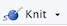

* Shortcut: Ctrl + Shift + k (MacOS: Shift + Cmd + k)

* Code `rmarkdown::render(“my_analysis.Rmd”)`

???
Imagine we've just done some awesome analysis and ready to share it.
Now we translate the RMarkdown document to an output format. 
We'll get back all the different outputs but for now stick to HTML
There are a number of ways to generate the output, everyone has their own preference.

Remember to explain the console output!

---
# Code Chunks

* Code --> Insert Chunk (Ctrl + Alt + I, MacOS: Alt + Cmd + I)

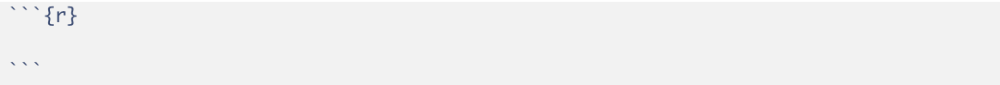

* Everything within the chunk is treated as code (reading, calculations, plotting)


* All output is displayed directly beneath the chunk

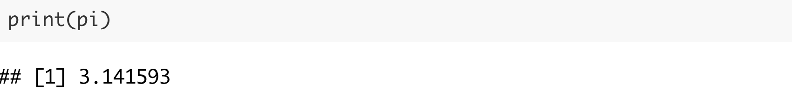

???
Talk about code chunks

---
# Code Chunks - Plotting

First, separate data from plotting chunk:

```{r, echo=FALSE}
pressure_high_temp <- pressure[pressure["temperature"] > 200, ]
```

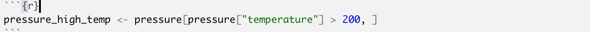

Then simply add plotting code:

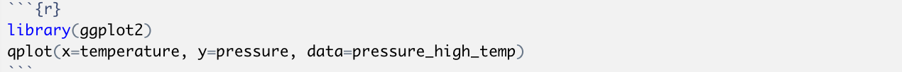

```{r, echo=FALSE}
library(ggplot2)
qplot(x=temperature, y=pressure, data=pressure_high_temp)
```

???
Talk about how plotting is special

---
# Customising Code Chunks

* Chunk options offer more control on the display of chunk outputs

* They are added in the chunk header

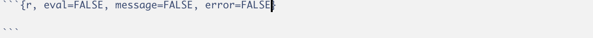

* For more information: : https://yihui.name/knitr/options/

* Specify global options if applicable to all chunks with `knitr::opts_chunk$set()`
???

Talk about options, go to yihui's page. Show some examples.

---
# Inline R Code

Simple code statements can be executed inline:

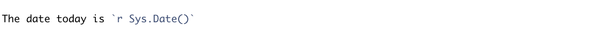

Using only variables created in the code chunks:


---
# Header

* Place for more document-level options such as the output format

* A RMarkdown document can have multiple output formats:
  * `html_document`
  * `pdf_document`
  * `word_document`
  * etc.

* Each format has a number of controls
* See `help(html_document)`

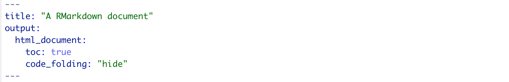

???
Talk about what the function is of the header
Mainly output format
Try out different formats

---
# Header - Setting parameters

* A report isn’t dynamic if you can’t change it

* Specify global parameters that can be set before generating the report

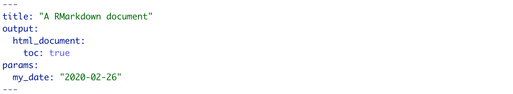

* Call the parameters in code using `params$<parameter name>`

* Or with `rmarkdown::render` or the Knit button  

???

Parameters are useful when you want to re-render the same report with distinct values for various key inputs, for example:
Running a report specific to a department or geographic region.
Running a report that covers a specific period in time.
Running multiple versions of a report for distinct sets of core assumptions.


---
# Tips & Tricks

* Other output formats: **beamer**, **rticles**, **prettydoc**, **rmdformats**, **markdowntemplates**

* Other languages: _engine_ chunk option

* Name your chunks for easier debugging

* Caching

* Automatic report generation
  * Roll your own: use `render()` with batch script
  * RStudio Connect

* Cheatsheet: https://github.com/rstudio/cheatsheets/raw/master/rmarkdown-2.0.pdf

???

---
# Posterdown

* Share your work through a ~~report~~ ~~presentation~~ conference poster

* With reproducibility baked in

* And all the other lovely RMarkdown goodies

* Simply change the output format to `posterdown::posterdown_html`


???
Documenting your analysis is one thing but at one point you will have to share it.
And if you're in academia then this will most likely be through a conference poster
I've made one in my lifetime and it wasn't nice. To many switching between R and PPT.
Enter: Posterdown!
Example:
Take default RMarkdown document and change output format
Show alternative way with Template function
Walk through some changes: title, number of columns, different output format

---
# Bookdown

* What if your analysis isn't just one RMarkdown doc?

* Bookdown: convert multiple RMarkdown into single output

* Output formats: HTML, PDF, GitBook

* Simplify writing process, type setting, editing

* Encourage reproducibility and collaboration

???
Why is it here?
What can you do with it 
Show examples online (R4DS book)
Simple Example: change output format to gitbook
Elaborate example: bookdown-demo

---
# Pkgdown

* And now for something completely different...

* RMarkdown is great for sharing analyses

* Packages are a great way to share your code

* Pkgdown: share package information through a website

* See https://pkgdown.r-lib.org

???
Moving on to something completely different. We've talked about sharing your analysis and how rmarkdown is a great solution for that . if your work is more than just an analysis, say it's some  code you wrote. then a great way of sharing that is through a pkg. pkdown is where these two things come together. it's a way t o share information about your pkg by creating a website from the pkg docs.
Example

---
# Blogdown

* Goal: Create a website

???
Moving further away from the basic premis of Rmarkdown, we arrive at blogdown. no longer is it about sharing one analysis but rather all your analyses and more!

The example: 

---

# There is so much more!

Go and explore!

???
